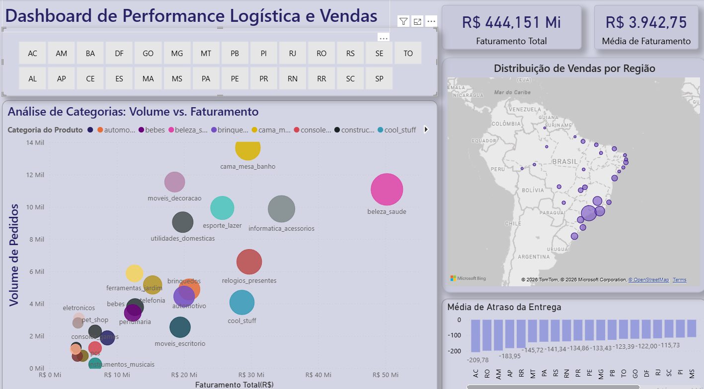
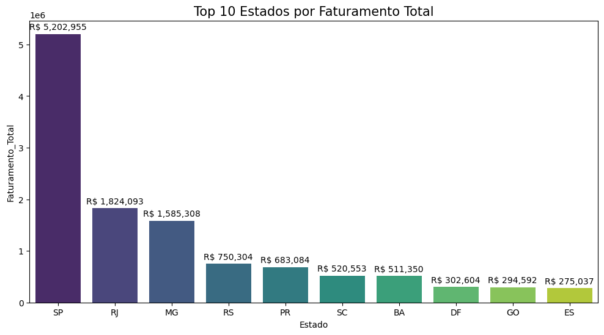
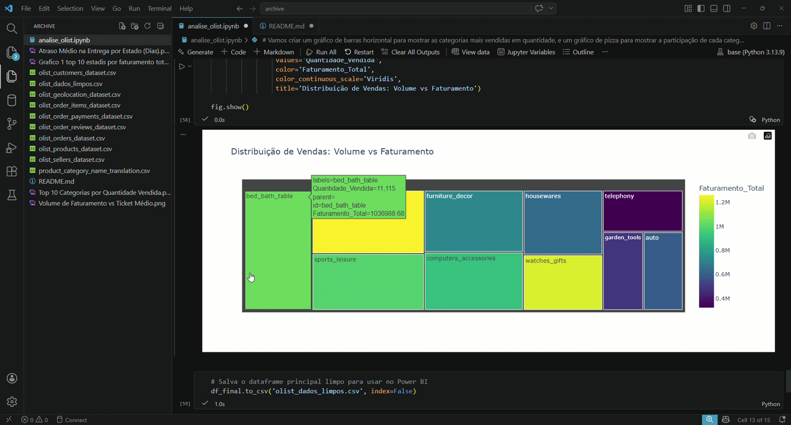

# 📊 Análise de Dados E-commerce: Olist Store
Este projeto apresenta uma análise 360º de uma operação de e-commerce brasileira, utilizando Python para engenharia de dados e Power BI para visualização estratégica.

## 🚀 Objetivo
Identificar gargalos logísticos, padrões de consumo regional e oportunidades de faturamento para otimizar a operação de vendas.

## 🛠️ Diferenciais Técnicos do Projeto

Modelagem de Dados & DAX: Implementação de medidas dinâmicas para ranking (Top N) e identificação da categoria principal por estado.

UX Avançado (Tooltips): Criação de páginas de dica de ferramenta (Tooltips) personalizadas que detalham o faturamento por categoria ao passar o mouse sobre o mapa, otimizando o espaço do dashboard.

Engenharia de Dados com Python: Merge e tratamento de múltiplas bases de dados relacionais para consolidação de uma visão única de performance.

## 🛠️ Tecnologias Utilizadas
* **Python 3.10** (Pandas, Matplotlib, Seaborn, Plotly)
* **VS Code** (Ambiente de desenvolvimento)
* **Power BI** (Dashboards interativos)
* **Dados:** [Brazilian E-Commerce Public Dataset by Olist](https://www.kaggle.com/datasets/olistbr/brazilian-ecommerce) (Kaggle)

## 📈 Principais Insights Extraídos

### 1. Visão de Mercado e Faturamento
O estado de São Paulo concentra a maior parte da operação, representando aproximadamente 38% do faturamento total. No entanto, estados das regiões Norte e Nordeste apresentam um **Ticket Médio superior**, indicando um perfil de consumo de produtos de maior valor agregado.

### 2. Matriz de Performance: Volume vs. Faturamento
As categorias de "Cama, Mesa e Banho" e "Beleza e Saúde" lideram em volume de pedidos. A análise interativa abaixo demonstra a distribuição entre a quantidade vendida e o faturamento gerado por cada categoria.

*Nota: Visualização interativa gerada com Plotly.*

### 3. Eficiência Logística
A análise revelou um SLA negativo médio de até X dias em estados como o Acre, sugerindo uma oportunidade de otimização na promessa de entrega para aumentar a conversão de vendas.

.png)

## 📁 Estrutura do Repositório
* `Analise_Exploratoria.ipynb`: Notebook com todo o processo de limpeza, merge de 5 tabelas e análise estatística.
* `Dashboard_Olist.pbix`: Arquivo do Power BI com visões interativas de logística e vendas. 

## 👤 Autor
**Igor Carvalho**
* [LinkedIn](https://www.linkedin.com/in/igor-carvalho-6b96422a8/)